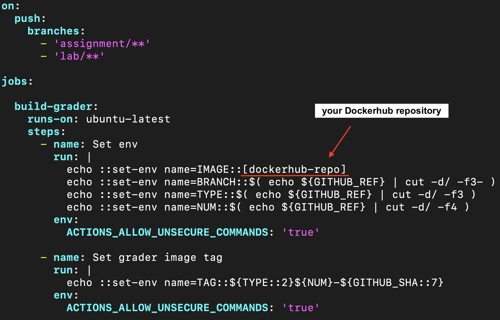
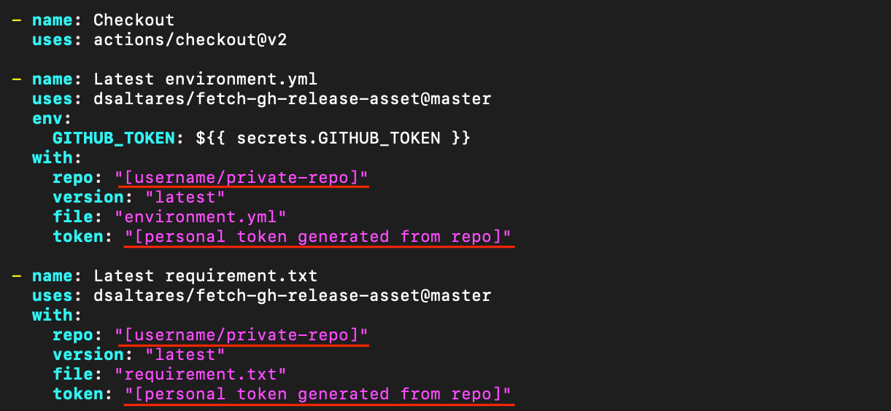
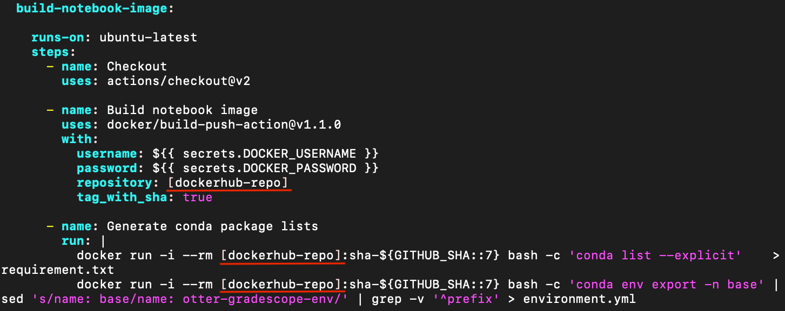
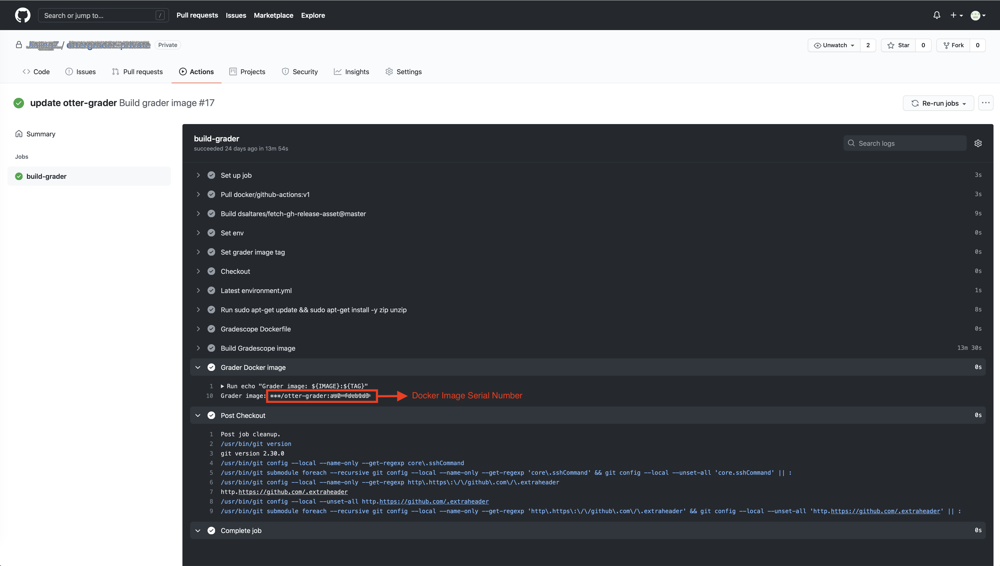

<!-- README.md is generated from README.Rmd. Please edit that file -->

```{r, echo = FALSE, message = F, warning = F}
knitr::opts_chunk$set(
  collapse = TRUE,
  comment = "#>",
  fig.path = "man/figures/figures-"
)
# library(package_name)
```


# Preparation

 - Create [GitHub](https://github.com), [docker](https://www.docker.com) and [gradescope](https://www.gradescope.com) accounts if you haven't already.
 
 - Create a new repository on GitHub: https://docs.github.com/en/github/creating-cloning-and-archiving-repositories/creating-a-new-repository
 
 - Create a personal access token: https://docs.github.com/en/github/authenticating-to-github/creating-a-personal-access-token
 
 - Create a new Docker Hub repositories: https://docs.docker.com/docker-hub/repos/
 
 
 
# Initial Setup

## Remote Public and Private Repository on GitHub

Create two new repositories on GitHub, instructions can be found [here](https://docs.github.com/en/github/creating-cloning-and-archiving-repositories/creating-a-new-repository). One repository will be open to students, which is a so-called public repository (`public-repo`), whereas the other will be used for development and testing (including solutions, shared with TAs etc.), which is a so-called private repository (`private-repo`).

Suppose that 

  - `public-repo` is at `https://github.com/[username]/public-repo.git`.
  
  - `private-repo` is at `https://github.com/[username]/private-repo.git`.
  
## Create Local Repository and Connect with Remote Repos

```
# create local repository #
mkdir ~/local-repo
cd ~/local-repo
git init

# connect local-repo to public-repo and private-repo #
git remote add public-repo https://github.com/username/public-repo.git
git remote add private-repo https://github.com/username/private-repo.git

# check remote git urls (optional) #
git remote -v
```

Add first file:
```
echo "# CLASS NAME" > README.md
git add README.md
git commit -m "first commit"
```
To avoid confusion, we set the default branch name (`master`) of `public-repo` to (`public`).
```
# rename the master branch of public-repo to public #
git branch -M public
# push to remote repository public-repo branch public, tracking changes of local branch public #
git push -u public-repo public
```

Create a new local branch `private`, which will be tracked by the remote repository `private-repo`；
```
git checkout -b private  ## create a new branch 'private' and switch to the branch
git push -u private-repo private
```

Now, `public-repo/public` and `private-repo/private` on GitHub are identical.

## Build Docker Images

### Create Docker Images

The following three files are needed for building docker images on GitHub:

- `~/work/.github/workflows/build-docker.yml`

- `~/work/.github/workflows/build-assignment.yml`

- `~/work/Dockerfile`

**Remark**: `build-assignment.yml` uses token to get access to the GitHub repositories, instructions for create a personal access token can be found [here](https://docs.github.com/en/github/authenticating-to-github/creating-a-personal-access-token).

Before adding these files to the private repository, parts underlined with a red line must be updated accordingly.

For `build-assignment.yml`,





For `build-docker.yml`,



The `build-docker.yml` is written in a way that it is looking for a specific branch named "docker", which will trigger a job for building a image on GitHub. So, we create a new branch name `docker` exactly.
```
# add necessary files for building images #
git add ~/work/.github/workflows/build-docker.yml
git add ~/work/.github/workflows/build-assignment.yml
git add ~/work/Dockerfile
git commit -m "add docker files"

git checkout -b docker ## create a new branch named 'docker' and switch to the branch
# push to remote repository private-repo branch docker, tracking changes of local branch docker #
git push -u private-repo docker ## this will kick off an action!
```

### Tag Docker Images

When a docker image is ready to release, we can tag it for more stable development. This will create a release page:
```
git tag -a v0.0.1 -m "first release" ## tag annotated as v0.0.1
git push --tags  ## push tag, make a release
```
When tag is pushed, another job will be triggered with name `v0.0.1`.

### Add Assignment and Build Assignment Docker Image Used on Gradescope

#### Add Initial Assignment Files 
```
# back to the 'private' branch #
git checkout private
git add assignment1-folder
git commit -m "add initial files for the first assignment"
git push  ## assignment1-folder pushed to repository private-repo branch private
# create a new branch for development of assignment1 #
git checkout -b assignment/1
git push -u private-repo assignment/1
```

**Remark**: The initial core assignment file should follosw specific [format](https://otter-grader.readthedocs.io/en/latest/otter_assign/python_notebook_format.html) for using `Otter-Grader` later on. Suppose, in our case, it is `assignment1.ipynb`.

#### Generate otter-grader for Assignment

Please first install [Otter-Grader](https://ucbds-infra.github.io/ds-course-infra-guide/autograding/otter.html) if you haven't already, following the instructions [here](https://otter-grader.readthedocs.io/en/latest/index.html#installation).

Then we use `Otter Assign` to create assignments with prompts, solutions and tests in a simple notebook format (`assignment1.ipynb`) that it then converts into sanitized versions for distribution to students and autograders:

```
# generate assignment #
otter assign assignment1.ipynb . Images/plot1.png
# add generated assignemnt files #
git add .
git commit -m "frist assignment"
git push
```
All generated assignment files are pushed to repository `private-repo` branch `assignment/1`.

As specified in the docker files, a branch named `assignment/1` will trigger a docker image building job for assignment1. When it finishes, we can copy and paste the generated serial number onto Gradescope for corresponding assignment (eg. assignment1). The serial number of the docker image can be find on the page similar to:

Replacing `***/otter-grader:...` to `your-dockerhub-id/otter-grader:...`.

#### Publish Student's Content to Public Repository (`public-repo`)
Do not `merge` or `add` but `checkout` relevant files to `public-repo/public`
```
git checkout public 
git checkout assignment/1 assignments/assignment1/student/
git commit -m "release assignment1"
```

#### Merge `private-repo/assignment/1` to `private-repo/private`

```
git checkout private
git merge assignment/1
git push
```

