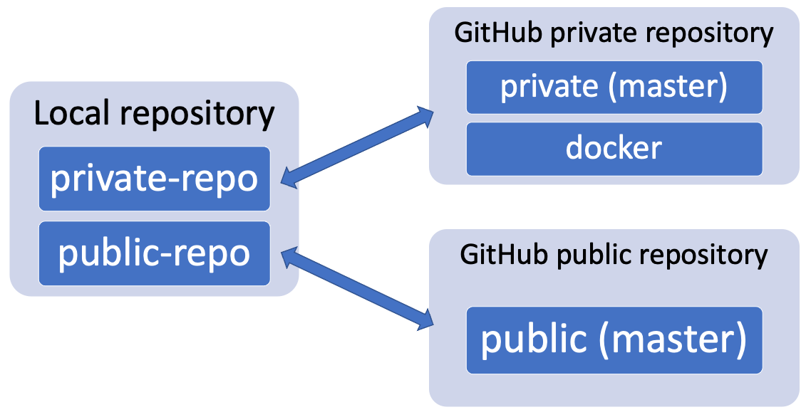
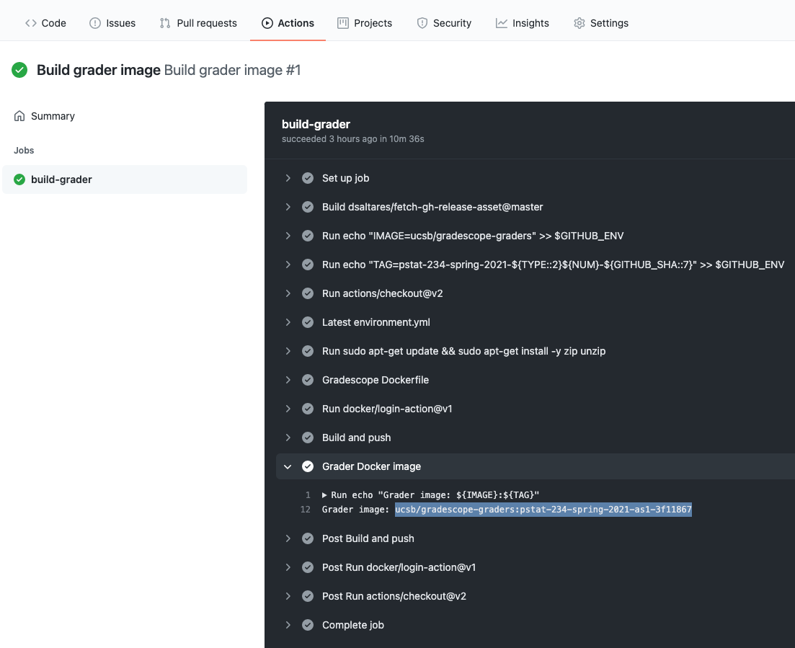
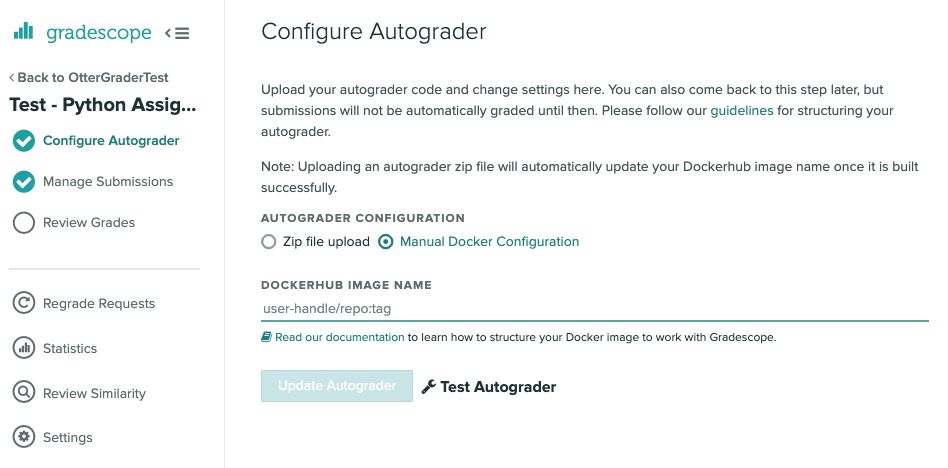

<!-- README.md is generated from README.Rmd. Please edit that file -->

Workflow Diagram
================

-   Local repository has two branches: `private` and `public`

-   There are two *separate* remote repositories: `private-repo` and
    `public-repo`

-   The local branch, `private`, is *only* associated with
    `private-repo`, and the local branch `public` is *only* associated
    with `public-repo` to avoid confusion.

Step-by-step Workflow
=====================

### 1. Directory structure

Directory structure of your local repository would look something like
this:

    local repository
    │   README.md
    |   Dockerfile
    |   ...
    │
    └───assignments
    │   │
    │   └───assignment1
    |       |   assignment1.ipynb
    |       |   ...
    │   │
    │   └───assignment2
    |       |   assignment2.ipynb
    |       |   ...
    │   
    └───labs
    │   │
    │   └───lab1
    |       |   lab1.ipynb
    |       |   ...
    │   │
    │   └───lab2
    |       |   lab2.ipynb
    |       |   ...

### 2. Generate student-template assignment and its autograder files

Once your master assignment file is ready, you can run the following
command to generate student-template assignment and its autograder
files. For lab, substitute `assignment[number].ipynb` to
`lab[number].ipynb`.

    otter assign assignment[number].ipynb .

where `.` indicates to create all outputs in the current directory.

### 3. Update gradescope image

Once you see `All tests passed!`, you can push all files in
`autograder/` and `student/` directories to `private-repo`. Note that
you need to first checkout a new branch `assignment/[number]` or
`lab/[number]`. This specific name of branch is required to trigger an
appropriate action on GitHub to generate a gradescope image.

    # checkout a new branch called assignment/[number]
    git checkout -b assignment/[number]

    # push necessary files to a specific branch of private-repo
    git add autograder/ student/
    git commit -m '[commit message]'
    git push -u private-repo assignment/[number]

When things are done correctly, you will be able to see the following
image under the action tab.

The shaded string is the `gradescope image`. Copying and pasting it to
`DOCKERHUB IMAGE NAME` and updating autograder as in the image below
finishes the job of setting up an autograder.

### 4. Release student-template to students

Now we release student-template to `public-repo`.

    # move over to public branch
    git checkout public

    # bring over student-template to public branch and push it to public-repo
    git checkout assignment/[number] assignments/assignment[number]/student/
    git commit -m "release assignment1"
    git push

### 5. Merge branch to master in private repository

At last, we merge the `assignment/[number]` branch to the default
branch.

    # move over to private branch
    git checkout private

    # merge assignment/[number] to the default branch
    git merge assignment/[number]
